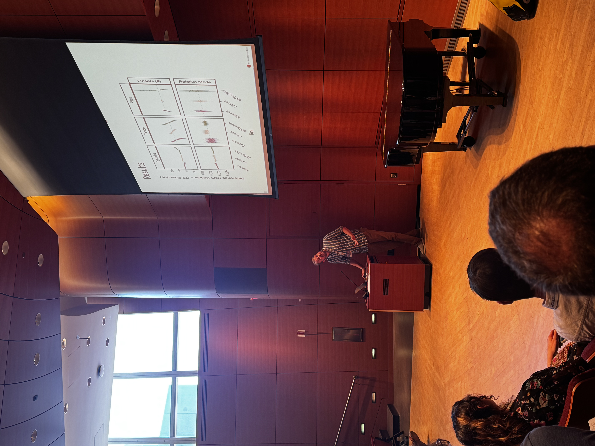

In July 2026, I had the opportunity to attend and present at the Society for Music Perception and Cognition Conference, hosted by Northwestern University in Evanston, Illinois. I presented a talk based on Chapter 3 of my PhD, titled "The Effect of Musical Transformations on Automated Music Feature Extraction". The talk focused on testing the reliability of music features extracted from audio using new approach: the Instability Audit. I've included the GitHub repository of the presentation slides below:

[Presentation Slides](https://github.com/konradswierczek/SMPC-2026-talk){.btn .btn-primary}

